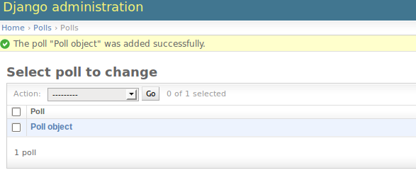

Project Status
--------------

This project is still very much under construction.  Any feedback is welcome!

Current progress

    - most of Django admin view (p. 2 of tutorial)

    - first Django model  (p. 1 of tutorial)

    - todo: views, forms (pp 3, 4)

So it's not *really* ready for someone to use as a proper tutorial yet.  If
you're impatient and you want to give it a go anyway, feel free!  The selenium
test runner should be of some use at least...

The Concept
-----------

This idea is to provide an introduction to Test-Driven web development using
Django (and Python).  Essentially, we run through the same material as the
official Django tutorial, but instead of 'just' writing code, we write tests
first at each stage - both "functional tests", in which we actually pretend to
be a user, and drive a real web browser, as well as "unit tests", which help us
to design and piece together the individual working parts of the code.

Who is this for?
----------------

Maybe you've done a bit of Python programming, and you're thinking of learning
Django, and you want to do it "properly".  Maybe you've done some test-driven
web development in another language, and you want to find out about how it all
works in the Python world.  Most importantly, you've heard of, or had experience
of, working on a project where complexity has started to get the better of you,
where you're scared to make changes, and you wished there had been better
testing from the get-go.

Who is this not for?
--------------------

If you know Python, Django and Selenium inside out, I suspect there's better things
that you can do with your time. If you're a total beginner programmer, I also
think it might not be quite right for you - you might do better to get a couple
of other tutorials under your belt first.  If you're already a programmer, but
have never tried Python, you'll be fine, but I thoroughly recommend the excellent
"Dive into Python" for a bit more of an insight into the language itself.

Why should you listen to me?
----------------------------

I was lucky enough to get my first "proper" software development job about a
year ago with a bunch of Extreme Programming fanatics, who've thoroughly
inculcated me into their cult of Test-Driven development.  Believe me when I
say I'm contrary enough to have questioned every single practice, challenged
every single decision, moaned about every extra minute spent doing "pointless"
tests instead of writing "proper" code.  But I've come round to the idea now,
and whenever I've had to go back to some of my old projects which don't have
tests, boy have I ever realised the wisdom of the approach.

So, I've learnt from some really good people, and the learning process is still 
fresh in my mind, so I hope I'll be good at communicating it.  Most importantly,
I still have the passion of a recent convert, so I hope I'll be good at conveying
some enthusiasm.

Why Test-Driven Development?
----------------------------

The thing is, when you start out on  a small project, you don't really need tests.
Tests take time to write - as much as, if not more than, the actual code for your
application.  You've got to learn testing frameworks, and they inevitably come 
with a whole host of their own problems (and this applies especially to web-browser
testing. oh boy.).  Meanwhile, you know you could just knock out a few lines of
code, and your application would be off the ground, and would start to be
useful. There are deadlines!  Clients who are paying for your time!  Or maybe
just the smell of that `Internet money`, and arriving late to the party means
none of it will be for you!

Well, that's all true.  At first.  At first, it's obvious whether everything 
works.  You can just log into the dev server, click around a bit, and see
whether everything looks OK.  And changing this bit of code over `here`, is
only ever going to affect these things `here` and `here`... So it's easy to
change stuff and see if you've broken anything...

But as soon as your project gets slightly larger, complexity rears its ugly
head.  Combinatorial explosion starts to make you its bitch. Changes start to
have unpredictable effects.  You start to worry about making changes to that
thing over there, because you wrote it ages ago, and you're pretty sure other
things depend on it... best to just use it as it is, even though it's hideously
ugly...  Well, anyway, changing this thing over `here` shouldn't affect too much
stuff.  I'll just run through the main bits of the site to check... Can't possibly
check everything though... Oh well, I'll just deploy and see if anyone complains...

Automated tests can save you from this fate.  If you have automated tests, you can
know for sure whether or not your latest changes broke anything.  With tests, 
you're free to keep refactoring your code, to keep trying out new ways to optimise
things, to keep adding new functionality, safe in the knowledge that your tests
will let you know if you get things wrong.

Look, that's got to be enough evangelising.  If you don't believe me, just ask
someone else with experience.  They know.  Now, onto the practicals.

What's the approach?
--------------------

Test-First!  So, before we're allowed to write any real production code, we write
some tests.  We start by writing some browser tests - what I call `functional`
tests, which simulate what an actual user would see and do.  We'll use `Selenium`,
a test tool which actually opens up a real web browser, and then drives it like
a real user, clicking on links and buttons, and checking what is shown on the
screen.  These are the tests that will tell us whether or not our application
behaves the way we want it to, from the user's point of view.

Once we've written our functional tests (which, incidentally, have forced us
to thing through the way our application will work, from the point of view
of the user - never a bad thing...) we can start to think about how we want
to implement that functionality from a technical point of view.

Thankfully we won't have to do too much difficult thinking, because the functional
tests will be our guide - what do we have to do to get the functional tests to
get a bit further towards passing?  How would we implement that?

Once we've settled on the function or the class that will solve our first problem,
we can write a unit test for it.  Again, it forces us to think about how it will
work from the outside, before we write it.

Some setup before we start
--------------------------

For functional testing, we'll be using the excellent Selenium.  Let's install that,
and Django, and a couple of other Python modules we might need::

    easy_install django
    easy_install selenium
    easy_install mock

Setting up our Django project, and settings.py
----------------------------------------------

Django structures websites as "projects", each of which can have several
constituent "apps"... Ostensibly, the idea is that apps can be self-contained,
so that you could use one app in several projects... Well, I've never actually
seen that done, but it remains a nice way of splitting up your code.

As per the official Django tutorial, we'll set up our project, and its first app,
a simple application to handle online polls.

Django has a couple of command line tools to set these up::

    django-admin startproject mysite
    cd mysite
    ./manage.py startapp polls

Django stores project-wide settings in a file called ``settings.py``. One of the key
settings is what kind of database to use.  We'll use the easiest possible, sqlite.

Find settings ``settings.py`` in the root of the new ``mysite`` folder, and
open it up in your favourite text editor. Find the lines that mention ``DATABASES``,
and change them, like so::

    DATABASES = {
        'default': {
            'ENGINE': 'django.db.backends.sqlite3', # Add 'postgresql_psycopg2', 'postgresql', 'mysql', 'sqlite3' or 'oracle'.
            'NAME': 'database.sqlite',                      # Or path to database file if using sqlite3.

Find out more about projects, apps and ``settings.py`` here:
https://docs.djangoproject.com/en/1.3/intro/tutorial01/#database-setup

Setting up the functional test runner
-------------------------------------

The next thing we need is a single command that will run all our FT's, as well
as a folder to keep them all in::

    mkdir fts
    touch fts/__init__.py

Here's one I made earlier... A little Python script that'll run all your tests
for you.::

    wget -O functional_tests.py https://raw.github.com/hjwp/Test-Driven-Django-Tutorial/master/functional_tests.py
    chmod +x functional_tests.py

We also need to set up a custom set of settings for the FT - we want to make
sure that our tests run against a different copy of the database from the
production one, so that we're not afraid of blowing away real data.

We'll do this by providing an alternative settings file for Django.  Create a
file called ``settings_for_fts.py`` next to settings.py, and give it the 
following contents::

    from settings import *
    DATABASES['default']['NAME'] = 'ft_database.sqlite'

That essentially sets up an exact duplicate of the normal ``settings.py``, 
except we change the name of the database.

Last bit of setup before we start:  syncdb
------------------------------------------

``syncdb`` is the command used to get Django to setup the database. It creates
any new tables that are needed, whenever you've added new stuff to your
project. In this case, it notices it's the first run, and proposes that
you create a superuser.  Let's go ahead and do that::

    python manage.py syncdb

Let's use the ultra-secure  ``admin`` and ``adm1n`` as our username and
password for the superuser.::

    harry@harry-laptop:~/workspace/mysite:master$ ./manage.py syncdb
    Username (Leave blank to use 'harry'): admin
    E-mail address: admin@example.com
    Password: 
    Password (again): 
    Superuser created successfully.
     

Our first test: The Django admin
--------------------------------

In the test-driven methodology, we tend to group functionality up into
bite-size chunks, and write functional tests for each one of them. You
can describe the chunks of functionality as "user stories", if you like,
and each user story tends to have a set of tests associated with it,
and the tests track the potential behaviour of a user.

We have to go all the way to the second page of the Django tutorial to see an
actual user-visible part of the application:  the `Django admin site`.  The 
admin site is a really useful part of Django, which generates a UI for site
administrators to manage key bits of information in your database: user
accounts, permissions groups, and, in our case, polls.  The admin site will let
admin users create new polls, enter their descriptive text and start and end
dates and so on, before they are published via the user-facing website. 
All this stuff comes 'for free' and automatically, just using the Django admin
site.  

You can find out more about the philosophy behind the admin site, including Django's
background in the newspaper industry, here:

https://docs.djangoproject.com/en/1.3/intro/tutorial02/

So, our first user story is that the user should be able to log into the Django
admin site using an admin username and password, and create a new poll.

.. image:: images/admin03t.png
.. image:: images/admin05t.png

Let's open up a file inside the ``fts`` directory called
``test_polls_admin.py`` and enter the code below.

Note the nice, descriptive names for the test functions, and the comments,
which describe in human-readable text the actions that our user will take.
Mhhhh, descriptive names.....

It's always nice to give the user a name... Mine is called Gertrude...::

    from functional_tests import FunctionalTest, ROOT

    class TestPollsAdmin(FunctionalTest):

        def test_can_create_new_poll_via_admin_site(self):

            # Gertrude opens her web browser, and goes to the admin page
            self.browser.get(ROOT + '/admin/')

            # She sees the familiar 'Django administration' heading
            body = self.browser.find_element_by_tag_name('body')
            self.assertIn('Django administration', body.text)

            # She types in her username and passwords and hits return
            username_field = self.browser.find_element_by_name('username')
            username_field.send_keys('admin')

            password_field = self.browser.find_element_by_name('password')
            password_field.send_keys('adm1n')
            password_field.send_keys(Keys.RETURN)

            # She now sees a couple of hyperlink that says "Polls"
            polls_links = self.browser.find_elements_by_link_text('Polls')
            self.assertEquals(len(polls_links), 2)

            # The second one looks more exciting, so she clicks it
            polls_links[1].click()

            # She is taken to the polls listing page, which shows she has
            # no polls yet
            body = self.browser.find_element_by_tag_name('body')
            self.assertIn('0 polls', body.text)

            # She sees a link to 'add' a new poll, so she clicks it
            new_poll_link = self.browser.find_element_by_link_text('Add poll')
            new_poll_link.click()

            #TODO: (we'll write the rest of the test code later)
            # She sees some input fields for "Question" and "Publication date"

            # She fills these in and clicks "Save" to create the new poll

            # She is returned to the "Polls" listing, where she can see her
            # new poll

Let's try running our first test::

    ./functional_tests.py

The test output will looks something like this::

    Starting Selenium
    selenium started
    starting django test server
    django test server running
    running tests
    F
    ======================================================================
    FAIL: test_can_create_new_poll_via_admin_site (test_polls_admin.TestPollsAdmin)
    ----------------------------------------------------------------------
    Traceback (most recent call last):
      File "/home/harry/workspace/mysite/fts/test_polls_admin.py", line 12, in test_can_create_new_poll_via_admin_site
        self.assertIn('Django administration', body.text)
    AssertionError: 'Django administration' not found in u"It worked!\nCongratulations on your first Django-powered page.\nOf course, you haven't actually done any work yet. Here's what to do next:\nIf you plan to use a database, edit the DATABASES setting in mysite/settings.py.\nStart your first app by running python mysite/manage.py startapp [appname].\nYou're seeing this message because you have DEBUG = True in your Django settings file and you haven't configured any URLs. Get to work!"

    ----------------------------------------------------------------------
    Ran 1 test in 4.754s

    FAILED (failures=1)

First few steps...
------------------

So, let's start trying to get our functional test to pass... or at least get a
little further on.  We'll need to set up the Django admin site.  This is on
page two of the official Django tutorial:

https://docs.djangoproject.com/en/1.3/intro/tutorial02/#activate-the-admin-site

At this point we need to do two things: add "django.contrib.admin" to
INSTALLED_APPS in ``settings.py``::

    INSTALLED_APPS = (
        'django.contrib.auth',
        'django.contrib.contenttypes',
        'django.contrib.sessions',
        'django.contrib.sites',
        'django.contrib.messages',
        # Uncomment the next line to enable the admin:
        'django.contrib.admin',
        # Uncomment the next line to enable admin documentation:
        # 'django.contrib.admindocs',
        'polls'
    )

And edit ``mysite/urls.py`` to uncomment the lines that reference the admin::

    from django.contrib import admin
    admin.autodiscover()
    urlpatterns = patterns('',
        # [...]
        # Uncomment the next line to enable the admin:
        url(r'^admin/', include(admin.site.urls)),
    )

Let's re-run our tests.  We should find they get a little further::

    ./functional_tests.py
    ======================================================================
    FAIL: test_can_create_new_poll_via_admin_site (test_polls_admin.TestPollsAdmin)
    ----------------------------------------------------------------------
    Traceback (most recent call last):
      File "/home/harry/workspace/mysite/fts/test_polls_admin.py", line 25, in test_can_create_new_poll_via_admin_site
        self.assertEquals(len(polls_links), 2)
    AssertionError: 0 != 2

    ----------------------------------------------------------------------
    Ran 1 test in 10.203s

Well, the test is happy that there's a Django admin site, and it can log in fine,
but it can't find a link to administer "Polls".  So next we need to create the
representation of a Poll inside Django - a `model`, in Django terms.

Our first unit tests: testing a new "Poll" model
------------------------------------------------

The Django unit test runner will automatically run any tests we put in
``tests.py``.  Later on, we might decide we want to put our tests somewhere
else, but for now, let's use that file::

    import datetime
    from django.test import TestCase
    from polls.models import Poll

    class TestPollsModel(TestCase):
        def test_creating_a_new_poll_and_saving_it_to_the_database(self):
            # start by creating a new Poll object with its "question" set
            poll = Poll()
            poll.question = "What's up?"

            # check we can save it to the database
            poll.save()

            # check we can adjust its publication date
            poll.pub_date = datetime.datetime(2012, 12, 25)
            poll.save()

            # now check we can find it in the database again
            all_polls_in_database = Poll.objects.all()
            self.assertEquals(len(all_polls_in_database), 1)
            only_poll_in_database = all_polls_in_database[0]
            self.assertEquals(only_poll_in_database, poll)

            # and check that it's saved its two attributes: question and pub_date
            self.assertEquals(only_poll_in_database.question, "What's up?")
            self.assertEquals(only_poll_in_database.pub_date, poll.pub_date)

Unit tests are designed to check that the individual parts of our code work
the way we want them too.  Aside from being useful as tests, they're useful
to help us think about the way we design our code... It forces us to think 
about how things are going to work, from a slightly external point of view.

<go into more detail on how ORM works>

Here we're creating a new Poll object, and checking that we can save it to 
the database, as well as checking that we can set and store a Poll's main two
attributes: the question and the publication date.::

    ./manage.py test

You should see an error like this::

      File "/usr/local/lib/python2.7/dist-packages/Django/test/simple.py", line 35, in get_tests
        test_module = __import__('.'.join(app_path + [TEST_MODULE]), {}, {}, TEST_MODULE)
      File "/home/harry/workspace/mysite/polls/tests.py", line 2, in <module>
        from polls.models import Poll
      ImportError: cannot import name Poll

Not the most interesting of test errors - we need to create a Poll object for the
test to import.  In TDD, once we've got a test that fails, we're finally allowed
to write some "real" code.  But only the minimum required to get the tests to get 
a tiny bit further on!

So let's create a minimal Poll class, in ``polls/models.py``::

    from django.db import models

    class Poll(object):
        pass 

And re-run the tests.  Pretty soon you'll get into the rhythm of TDD - run the
tests, change a tiny bit of code, check the tests again, see what tiny bit of
code to write next. Run the tests...::

    Creating test database for alias 'default'...
    ........................................................................................................................................................................................................................................................................E..........................................................
    ======================================================================
    ERROR: test_creating_a_poll (polls.tests.TestPollsModel)
    ----------------------------------------------------------------------
    Traceback (most recent call last):
      File "/home/harry/workspace/mysite/polls/tests.py", line 8, in test_creating_a_poll
        self.assertEquals(poll.name, '')
    AttributeError: 'Poll' object has no attribute 'save'

    ----------------------------------------------------------------------
    Ran 323 tests in 2.504s

    FAILED (errors=1)
    Destroying test database for alias 'default'...

Right, the tests are telling us that we can't "save" our Poll.  That's because
it's not a Django model object.  Let's make the minimal change required to get 
our tests further on::

    class Poll(models.Model):
        pass

Running the tests again, we should see a slight change to the error message::

    ======================================================================
    ERROR: test_creating_a_new_poll_and_saving_it_to_the_database (polls.tests.TestPollsModel)
    ----------------------------------------------------------------------
    Traceback (most recent call last):
      File "/home/harry/workspace/mysite/polls/tests.py", line 26, in test_creating_a_new_poll_and_saving_it_to_the_database
        self.assertEquals(only_poll_in_database.question, "What's up?")
    AttributeError: 'Poll' object has no attribute 'question'

----------------------------------------------------------------------

Notice that the tests have got all the way through to line 26, where we retrieve
the object back out of the database, and it's telling us that we haven't saved the
question attribute.  Let's fix that::

    class Poll(models.Model):
        question = models.CharField(max_length=200)

<(note on max_length=200)?>

Now our tests get slightly further - they tell us we need to add a pub_date::

    ======================================================================
    ERROR: test_creating_a_new_poll_and_saving_it_to_the_database (polls.tests.TestPollsModel)
    ----------------------------------------------------------------------
    Traceback (most recent call last):
      File "/home/harry/workspace/mysite/polls/tests.py", line 27, in test_creating_a_new_poll_and_saving_it_to_the_database
        self.assertEquals(only_poll_in_database.pub_date, poll.pub_date)
    AttributeError: 'Poll' object has no attribute 'pub_date'
    ----------------------------------------------------------------------

Let's add that too::

    class Poll(models.Model):
        question = models.CharField(max_length=200)
        pub_date = models.DateTimeField()

And run the tests again::

    ...................................................................................................................................................................................................................................................................................................................................
    ----------------------------------------------------------------------
    Ran 323 tests in 2.402s

    OK

Hooray!  The joy of that unbroken string of dots!  That lovely, understated "OK".

Back to the functional tests: registering the model with the admin site
-----------------------------------------------------------------------

The unit tests all pass. Does this mean our functional test will pass?::

    ./functional_tests.py
    ======================================================================
    FAIL: test_can_create_new_poll_via_admin_site (test_polls_admin.TestPollsAdmin)
    ----------------------------------------------------------------------
    Traceback (most recent call last):
      File "/home/harry/workspace/mysite/fts/test_polls_admin.py", line 25, in test_can_create_new_poll_via_admin_site
        self.assertEquals(len(polls_links), 2)
    AssertionError: 0 != 2

    ----------------------------------------------------------------------
    Ran 1 test in 10.203s

Ah, not quite.  The Django admin site doesn't automatically contain every model
you define - you need to tell it which models you want to be able to administer.
To do that, we just need to create a file called ``admin.py`` in the ``polls``
directory, with the following three lines::

    from polls.models import Poll
    from django.contrib import admin

    admin.site.register(Poll)

Let's try the FT again...::

    ./functional_tests.py
    .
    ----------------------------------------------------------------------
    Ran 1 test in 6.164s

    OK

Hooray! 

Exploring the site manually using runserver 
-------------------------------------------

So far so good.  But, we still have a few items left as "TODO" in our tests.
At this point we may not be quite sure what we want though.  This is a good
time to fire up the Django dev server using ``runserver``, and have a look
around manually, to look for some inspiration on the next steps to take for our
site.::

    python manage.py runserver

Then, open your web browser and go to ``http://localhost:8000/admin``.
Let's follow the steps in the FT - enter the admin username and password (``adm1n``),
find the link to "Polls' and you'll probably see an error page, in yellow,
that contains something like this::

    DatabaseError at /admin/polls/poll/

    no such table: polls_poll

    Request Method: 	GET
    Request URL: 	http://localhost:8000/admin/polls/poll/
    Django Version: 	1.3.1
    Exception Type: 	DatabaseError
    Exception Value: 	

    no such table: polls_poll

    Exception Location: 	/usr/local/lib/python2.7/dist-packages/django/db/backends/sqlite3/base.py in execute, line 234
    Python Executable: 	/usr/bin/python
    Python Version: 	2.7.1
    [etc]

When Django encounters an error trying to render a page, it displays a page
full of debugging information like this, to help you figure out what went
wrong.

When your application is ready to show to real users, you'll want to set
``DEBUG = False`` in your ``settings.py``, because you don't want your users
seeing that sort of information (Django can email it to you instead).  In the
meantime, it's very useful! 

So, Django is telling us it can't find a database table called ``poll_poll``.

Django names tables using the convention ``appname_lowercasemodelname``, so
this is the table for our Poll object, and we haven't told Django to create it
for us yet.  "What about the tests", I hear you ask, "they seemed to run
fine?!".  Well, if you remember we set up a different database for our FTs, and
the the Django unit test runner also uses its own database.

So, as far as your production database is concerned, you'll need to run
``syncdb`` manually, each time you create a new class in ``models.py`` .  Press
Ctrl+C to quit the test server, and then::

    python manage.py syncb

    Creating tables ...
    Creating table polls_poll
    Installing custom SQL ...
    Installing indexes ...
    No fixtures found.

Inspecting the admin site to decide what to test next
-----------------------------------------------------

Let's run ``python manage.py runserver`` again, and go take another look at the
admin pages. If you try and create a new Poll, you should see a menu a bit like
this.

.. image:: images/add_poll_need_verbose_name_for_pub_date.png

Pretty neat, but `Pub date` isn't a very nice label for our publication date
field.  Django normally generates labels for its admin fields automatically,
by just taking the field name and capitalising it, converting underscores
to spaces.  So that works well for ``question``, but not so well for ``pub_date``.

So that's one thing we'll want to change.  Let's add a test for that to the end of
our FT::

        # She sees a link to 'add' a new poll, so she clicks it
        new_poll_link = self.browser.find_element_by_link_text('Add poll')
        new_poll_link.click()

        # She sees some input fields for "Question" and "Date published"
        body = self.browser.find_element_by_tag_name('body')
        self.assertIn('Question:', body.text)
        self.assertIn('Date published:', body.text)

More ways of finding elements on the page using Selenium
--------------------------------------------------------

Try filling in a new Poll, and fill in the 'date' entry but not a 'time'.  You'll
find django complains that the field is required. So, in our test, we need to
fill in three fields: `question`, `date`, and `time`. 

In order to get Selenium to find the text input boxes for those fields, there
are several options::

    find_element_by_id 
    find_element_by_xpath
    find_element_by_link_text
    find_element_by_name
    find_element_by_tag_name
    find_element_by_css_selector

And several others - the Selenium Webdriver documentation is still a bit sparse,
but you can look at the source code, and most of the methods have fairly self-
explanatory names...

http://code.google.com/p/selenium/source/browse/trunk/py/selenium/webdriver/remote/webdriver.py

In our case `by name` is a useful way of finding fields, because the name
attribute is usually associated with input fields from forms.  If you take a
look at the HTML source code for the Django admin page for entering a new poll
(either the raw source, or using a tool like Firebug, or developer tools in
Google Chrome), you'll find out that the 'name' for our three fields are
`question`, `pub_date_0` and `pub_date_1`.::

    <label for="id_question" class="required">Question:</label>
    <input id="id_question" type="text" class="vTextField" name="question" maxlength="200" />

    <label for="id_pub_date_0" class="required">Date published:</label>
    

        Date: 
        <input id="id_pub_date_0" type="text" class="vDateField" name="pub_date_0" size="10" />
         
        Time:
        <input id="id_pub_date_1" type="text" class="vTimeField" name="pub_date_1" size="8" />
    

                        
                    

Let's use them in our FT:: 

        # She sees some input fields for "Question" and "Date published"
        body = self.browser.find_element_by_tag_name('body')
        self.assertIn('Question:', body.text)
        self.assertIn('Date published:', body.text)

        # She types in an interesting question for the Poll
        question_field = self.browser.find_element_by_name('question')
        question_field.send_keys("How awesome is Test-Driven Development?")

        # She sets the date and time of publication - it'll be a new year's
        # poll!
        date_field = self.browser.find_element_by_name('pub_date_0')
        date_field.send_keys('01/01/12')
        time_field = self.browser.find_element_by_name('pub_date_1')
        time_field.send_keys('00:00')

We can also use the CSS selector to pick up the "Save" button::

        save_button = self.browser.find_element_by_css_selector("input[value='Save']")
        save_button.click()

Finally, we'll want to have our test check that the new Poll appears on the listings
page.  If you've entered a Poll, you'll have noticed that the polls are just described
as "Poll object".  

Django lets you give them more descriptive names, including any attribute of
the object.  So let's say we want our polls listed by their question::

        # She is returned to the "Polls" listing, where she can see her
        # new poll, listed as a clickable link
        new_poll_links = self.browser.find_elements_by_link_text(
                "How awesome is Test-Driven Development?"
        )
        self.assertEquals(len(new_poll_links), 1)

That's our FT finished.  If you've lost track in amongst all the copy & pasting,
you can compare your version to mine, which is hosted here:
https://github.com/hjwp/Test-Driven-Django-Tutorial/blob/master/fts/test_polls_admin.py

Human-readable names for models and their attributes
----------------------------------------------------

Let's re-run our tests.  Here's our first expected failure, the fact that "Pub date"
isn't the label we want for our field ("Date published")::

    ======================================================================
    FAIL: test_can_create_new_poll_via_admin_site (test_polls_admin.TestPollsAdmin)
    ----------------------------------------------------------------------
    Traceback (most recent call last):
      File "/home/harry/workspace/mysite/fts/test_polls_admin.py", line 43, in test_can_create_new_poll_via_admin_site
        self.assertIn('Date published:', body.text)
        django.kill() #TODO: doesn't kill child processes, fix
    AssertionError: 'Date published:' not found in u'Django administration\nWelcome, admin. Change password / Log out\nHome \u203a Polls \u203a Polls \u203a Add poll\nAdd poll\nQuestion:\nPub date:\nDate:  Today | \nTime:  Now | '

    ----------------------------------------------------------------------

Django stores human-readable names for model attributes in a special attribute
called `verbose_name`.  Let's write a unit test that checks the verbose name
for our ``pub_date`` field.  Add the following method to ``polls\tests.py``::

    def test_verbose_name_for_pub_date(self):
        for field in Poll._meta.fields:
            if field.name ==  'pub_date':
                self.assertEquals(field.verbose_name, 'Date published')

To write this test, we have to grovel through the ``_meta`` attribute on the
Poll class.  That's some Django-voodoo right there, and you may have to take my
word for it, but it's a way to get at some of the information about the
metadata on the model. There's more info here (James Bennet is one of the
original Django developers, and wrote a book about it too)
http://www.b-list.org/weblog/2007/nov/04/working-models/

Anyway, running our tests with ``python manage.py test`` gives us our expected
fail::

    AssertionError: 'pub date' != 'Date published'

And we can make the change in ``models.py``::

    class Poll(models.Model):
        question = models.CharField(max_length=200)
        pub_date = models.DateTimeField(verbose_name='Date published')

Re-running our functional tests, things have moved on::

    ======================================================================
    FAIL: test_can_create_new_poll_via_admin_site (test_polls_admin.TestPollsAdmin)
    ----------------------------------------------------------------------
    Traceback (most recent call last):
      File "/home/harry/workspace/mysite/fts/test_polls_admin.py", line 63, in test_can_create_new_poll_via_admin_site
        self.assertEquals(len(new_poll_links), 1)
    AssertionError: 0 != 1

    ----------------------------------------------------------------------

We're almost there - the FT is complaining it can't find a link to a Poll
which has the text of our question.  To make this work, we need to tell
Django how to print out a Poll object.  this happens in the ``__unicode__``
method.  As usual, we unit test first, in this case it's a very simple one::

    def test_poll_objects_are_named_after_their_question(self):
        p = Poll()
        p.question = 'How is babby formed?'
        self.assertEquals(unicode(p), 'How is babby formed?')

Running the unit tests shows the following error::

    ======================================================================
    FAIL: test_poll_objects_are_named_after_their_question (polls.tests.TestPollsModel)
    ----------------------------------------------------------------------
    Traceback (most recent call last):
      File "/home/harry/workspace/mysite/polls/tests.py", line 37, in test_poll_objects_are_named_after_their_question
        self.assertEquals(unicode(p), 'How is babby formed?')
    AssertionError: u'Poll object' != 'How is babby formed?'

    ----------------------------------------------------------------------

And the fix is simple too - we define a ``__unicode__`` method on our Poll class,
in ``models.py``::

    class Poll(models.Model):
        question = models.CharField(max_length=200)
        pub_date = models.DateTimeField(verbose_name='Date published')

        def __unicode__(self):
            return self.question

And you should now find that the unit tests pass::

    harry@harry-laptop:~/workspace/mysite:master$ ./manage.py test
    Creating test database for alias 'default'...
    .....................................................................................................................................................................................................................................................................................................................................
    ----------------------------------------------------------------------
    Ran 325 tests in 2.526s

And now, our functional tests should pass::

    ----------------------------------------------------------------------
    Ran 1 test in 7.065s

    OK
 

Hooray!  That's it, there's our first, well-tested, proper-TDD, Django model.

Tune in next week for more!

LINKS
=====

https://docs.djangoproject.com/en/dev/intro/tutorial02/

http://pypi.python.org/pypi/selenium

http://code.google.com/p/selenium/source/browse/trunk/py/selenium/webdriver/remote/webdriver.py

http://code.google.com/p/selenium/source/browse/trunk/py/selenium/webdriver/remote/webelement.py
